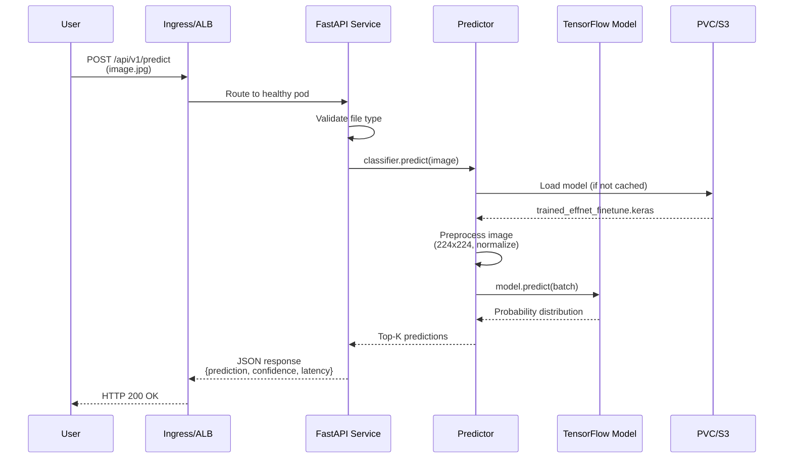

<div align="center">

# ☀️ Solar Panel Condition Classifier

[](https://www.python.org/)
[](https://tensorflow.org/)
[](https://streamlit.io/)
[](https://fastapi.tiangolo.com/)
[](https://docker.com/)
[](https://kubernetes.io/)
[](https://aws.amazon.com/)
[](tests/)
[](LICENSE)

**A production-ready, enterprise-grade deep learning project for classifying solar panel images into six condition categories using 2D CNNs.**

Deploy via **Streamlit**, **FastAPI**, **Docker**, **Kubernetes**, or **AWS EC2**.

[Quick Start](#-quick-start) • [API Docs](docs/api_docs.md) • [Architecture](docs/architecture.md)

</div>

---

## 📋 Table of Contents

- [Overview](#-overview)
- [Quick Start](#-quick-start)
- [Enterprise Architecture](#-enterprise-architecture)
- [Features](#-features)
- [Dataset](#-dataset)
- [Model Performance](#-model-performance)
- [Project Structure](#-project-structure)
- [Installation](#-installation)
- [Usage](#-usage)
- [API Documentation](#-api-documentation)
- [Environment Variables](#-environment-variables)
- [Docker Deployment](#-docker-deployment)
- [Kubernetes Deployment](#-kubernetes-deployment)
- [AWS Deployment (Terraform)](#-aws-deployment-terraform)
- [CI/CD](#-cicd)
- [Testing](#-testing)
- [Training](#-training)
- [Troubleshooting](#-troubleshooting)
- [License](#-license)

---

## 🌟 Overview

Solar panels are exposed to various environmental conditions that degrade their efficiency. This project automates the detection and classification of solar panel conditions from images, enabling faster maintenance and monitoring.

**Supported Conditions:**

| # | Class | Description |
|---|-------|-------------|
| 1 | 🐦 `Bird-drop` | Bird droppings on panel surface |
| 2 | ✨ `Clean` | Normal/clean panel condition |
| 3 | 🌫️ `Dusty` | Dust accumulation on panels |
| 4 | ⚡ `Electrical-damage` | Electrical faults or hotspots |
| 5 | 🔧 `Physical-Damage` | Cracks, scratches, or breaks |
| 6 | ❄️ `Snow-Covered` | Snow blocking the panel surface |

---

## 🏗️ System Architecture

### End-to-End Deployment Architecture

```mermaid
graph TB
    subgraph Client["Client Layer"]
        A[Browser<br/>Streamlit UI]
        B[Mobile App]
        C[CLI Tool]
        D[Python SDK]
    end

    subgraph Ingress["Ingress Layer"]
        E[NGINX Ingress Controller<br/>TLS 1.3 | Rate Limit]
        F[AWS Application Load Balancer]
    end

    subgraph K8s["Kubernetes Cluster"]
        G[FastAPI Pod 1]
        H[FastAPI Pod 2]
        I[FastAPI Pod N]
        J[HPA<br/>3-20 Replicas]
        K[(PVC<br/>Model Storage)]
        L[ConfigMap]
    end

    subgraph AWS["AWS Infrastructure"]
        M[EC2 Auto Scaling<br/>t3.medium]
        N[ECR Container Registry]
        O[S3 Model Bucket<br/>Versioned | Encrypted]
        P[CloudWatch Logs]
    end

    subgraph TF["TensorFlow Runtime"]
        Q[EfficientNetB0<br/>~81.4% Acc]
        R[MobileNetV2<br/>~75.7% Acc]
    end

    A --> E
    B --> E
    C --> E
    D --> E

    E --> G
    E --> H
    F --> M

    G --> K
    H --> K
    I --> K
    G --> L
    H --> L

    G --> Q
    H --> R
    M --> Q

    N --> G
    N --> H
    N --> M
    O --> K
    G --> P
    H --> P

    style Client fill:#e1f5fe
    style Ingress fill:#fff3e0
    style K8s fill:#e8f5e9
    style AWS fill:#fce4ec
    style TF fill:#f3e5f5
```

### MLOps Data Pipeline

```mermaid
graph LR
    A[Raw Images<br/>Data/] --> B[Data Validation]
    B --> C[Data Augmentation<br/>Flip | Rotate | Zoom]
    C --> D[Train/Test Split<br/>80/20]
    D --> E[Feature Extraction<br/>EfficientNetB0]
    E --> F[Model Training<br/>Transfer Learning]
    F --> G[Hyperparameter Tuning<br/>Keras Tuner]
    G --> H[Model Evaluation<br/>Val Accuracy]
    H --> I{Accuracy > 80%?}
    I -->|No| F
    I -->|Yes| J[Model Registry<br/>S3 / ECR]
    J --> K[FastAPI Service]
    J --> L[Streamlit UI]
    K --> M[Monitoring<br/>CloudWatch / Prometheus]

    style A fill:#e1f5fe
    style F fill:#e8f5e9
    style I fill:#fff3e0
    style J fill:#fce4ec
    style M fill:#f3e5f5
```

### CI/CD Pipeline Workflow

```mermaid
graph LR
    A[Developer Push] --> B[GitHub Actions]
    B --> C[Code Quality<br/>Black | Flake8 | MyPy]
    C --> D[Unit Tests<br/>pytest]
    D --> E[Integration Tests<br/>FastAPI]
    E --> F[Security Scan<br/>Bandit | Safety]
    F --> G[Docker Build]
    G --> H{Branch == main?}
    H -->|Yes| I[Push to ECR]
    H -->|No| J[Skip Deploy]
    I --> K[Terraform Apply]
    K --> L[AWS Infrastructure]
    I --> M[Kubernetes Deploy]
    M --> N[K8s Cluster]

    style A fill:#e1f5fe
    style C fill:#e8f5e9
    style D fill:#e8f5e9
    style E fill:#e8f5e9
    style F fill:#fff3e0
    style G fill:#fce4ec
    style K fill:#fce4ec
    style M fill:#fce4ec
```

### Inference Request Flow



---

## ⚡ Quick Start

```bash
# 1. Clone and enter the project
cd Classification_CNN_2D

# 2. Setup environment
make setup

# 3. Start the Streamlit web app
make streamlit
# → Open http://localhost:8501

# 4. Or start the FastAPI service
make api
# → Open http://localhost:8000/docs
```

---

## 🏗️ Enterprise Architecture

```
┌─────────────────────────────────────────────────────────────────────────────┐
│                              CLIENT LAYER                                    │
│  ┌──────────────┐  ┌──────────────┐  ┌──────────────┐  ┌──────────────┐   │
│  │   Browser    │  │   Mobile     │  │   CLI Tool   │  │   Python     │   │
│  │  (Streamlit) │  │    App       │  │   (main.py)  │  │    API       │   │
│  └──────┬───────┘  └──────┬───────┘  └──────┬───────┘  └──────┬───────┘   │
└─────────┼─────────────────┼─────────────────┼─────────────────┼───────────┘
          │                 │                 │                 │
          └─────────────────┴─────────────────┴─────────────────┘
                                    │
┌───────────────────────────────────┼─────────────────────────────────────────┐
│                          LOAD BALANCER (ALB / Ingress)                       │
│                           TLS 1.3 | Rate Limiting                            │
└───────────────────────────────────┼─────────────────────────────────────────┘
                                    │
          ┌─────────────────────────┼─────────────────────────┐
          │                         │                         │
┌─────────▼─────────┐   ┌───────────▼───────────┐   ┌────────▼────────┐
│   FastAPI Pod 1   │   │    FastAPI Pod 2      │   │  FastAPI Pod N  │
│   (Port 8000)     │   │    (Port 8000)        │   │  (Port 8000)    │
│  ┌─────────────┐  │   │   ┌─────────────┐     │   │  ┌────────────┐ │
│  │  TensorFlow │  │   │   │  TensorFlow │     │   │  │ TensorFlow │ │
│  │    Model    │  │   │   │    Model    │     │   │  │   Model    │ │
│  └─────────────┘  │   │   └─────────────┘     │   │  └────────────┘ │
└─────────┬─────────┘   └───────────┬───────────┘   └────────┬────────┘
          │                         │                         │
          └─────────────────────────┼─────────────────────────┘
                                    │
┌───────────────────────────────────▼─────────────────────────────────────────┐
│                         KUBERNETES / AWS EC2                                 │
│  ┌────────────┐  ┌────────────┐  ┌────────────┐  ┌────────────┐            │
│  │  ConfigMap │  │    PVC     │  │    HPA     │  │  Network   │            │
│  │   (env)    │  │  (models)  │  │  (3-20)    │  │   Policy   │            │
│  └────────────┘  └────────────┘  └────────────┘  └────────────┘            │
└─────────────────────────────────────────────────────────────────────────────┘
                                    │
┌───────────────────────────────────▼─────────────────────────────────────────┐
│                         INFRASTRUCTURE (Terraform)                           │
│  ┌────────────┐  ┌────────────┐  ┌────────────┐  ┌────────────┐            │
│  │    VPC     │  │   ECR      │  │    S3      │  │ CloudWatch │            │
│  │ (Pub/Priv) │  │ (Registry) │  │ (Models)   │  │ (Monitoring│            │
│  └────────────┘  └────────────┘  └────────────┘  └────────────┘            │
└─────────────────────────────────────────────────────────────────────────────┘
```

**Key Enterprise Features:**
- **High Availability:** Multi-zone deployment with auto-scaling (3–20 replicas)
- **Security:** Non-root containers, TLS 1.3, network policies, IAM roles
- **Observability:** Health checks, Prometheus metrics, CloudWatch logs
- **Scalability:** HPA based on CPU/memory, ALB target tracking
- **CI/CD:** GitHub Actions with lint, test, security scan, Docker build

---

## ✨ Features

- **Multiple Architectures:** Custom CNN, MobileNetV2, and EfficientNetB0 with transfer learning
- **Hyperparameter Tuning:** Keras Tuner integration for optimal model configuration
- **Class Imbalance Handling:** Automatic class-weight computation for biased datasets
- **Data Augmentation:** Built-in random flip, rotation, and zoom augmentation
- **FastAPI Service:** Production REST API with health checks, batch inference, and auto-generated docs
- **Streamlit UI:** Interactive web app with inference latency benchmarking
- **CLI Tool:** Command-line interface for batch or single-image inference
- **Entity Layer:** Type-safe configuration dataclasses for MLOps pipeline stages
- **Docker Ready:** Multi-stage Dockerfile + docker-compose for local orchestration
- **Kubernetes Ready:** Full K8s manifests with HPA, ingress, network policies, and Kustomize overlays
- **AWS Infrastructure:** Terraform modules for VPC, EC2, ALB, Auto Scaling, ECR, S3
- **CI/CD Pipeline:** GitHub Actions with lint, test, security scan, and build stages
- **Test Suite:** Unit and integration tests included

---

## 📊 Dataset

- **Source:** Custom solar panel image dataset
- **Total Images:** ~872
- **Classes:** 6
- **Image Size:** 224 × 224 pixels
- **Train/Validation Split:** 80 / 20

**Class Distribution:**

| Class | Images |
|-------|--------|
| Bird-drop | 193 |
| Clean | 194 |
| Dusty | 190 |
| Electrical-damage | 103 |
| Physical-Damage | 69 |
| Snow-Covered | 123 |

> ⚠️ The dataset is imbalanced (`Physical-Damage` is under-represented). Training uses computed class weights to mitigate bias.

---

## 🧠 Model Performance

| Model | Architecture | Validation Accuracy | Params | Best For |
|-------|------------|---------------------|--------|----------|
| `trained_effnet_finetune` | EfficientNetB0 + HPO | **~81.4%** | ~4.2M | **Production (Recommended)** |
| `mobilenetv2_2` | MobileNetV2 | ~75.7% | ~2.4M | Mobile / Edge deployment |

**Key Techniques Used:**
- Transfer Learning (ImageNet weights)
- Data Augmentation (flip, rotation, zoom)
- Early Stopping & Learning Rate Reduction
- L2 Regularization & Dropout
- Class Weight Balancing

---

## 🗂️ Project Structure

```
Classification_CNN_2D/
│
├── .github/
│   └── workflows/
│       └── ci-cd.yml            # GitHub Actions CI/CD pipeline
│
├── aws/
│   └── ec2-scripts/
│       ├── deploy.sh            # AWS full deployment script
│       └── setup_ec2.sh         # EC2 bootstrap script
│
├── config/
│   └── config.yaml              # Centralized configuration
│
├── docker/
│   ├── Dockerfile               # Production multi-stage build
│   └── Dockerfile.dev           # Development image
│
├── docs/
│   ├── architecture.md          # System architecture documentation
│   └── api_docs.md              # REST API reference
│
├── k8s/
│   ├── base/                    # Base K8s manifests
│   │   ├── namespace.yaml
│   │   ├── configmap.yaml
│   │   ├── deployment.yaml
│   │   ├── service.yaml
│   │   ├── ingress.yaml
│   │   ├── hpa.yaml
│   │   ├── pvc.yaml
│   │   ├── serviceaccount.yaml
│   │   └── networkpolicy.yaml
│   └── overlays/                # Kustomize environment overlays
│       ├── dev/
│       └── prod/
│
├── models/                      # Trained model artifacts
│   ├── trained_effnet_finetune.keras   ⭐ Best model
│   ├── trained_effnet_finetune.h5
│   ├── mobilenetv2_2.keras
│   └── mobilenetv2_2.h5
│
├── notebooks/
│   └── Solar_Panel_Classification.ipynb
│
├── src/
│   ├── api/
│   │   └── main.py              # FastAPI inference service
│   └── solar_panel_classifier/  # Reusable Python package
│       ├── config.py            # Paths & constants
│       ├── data_loader.py       # Image preprocessing utilities
│       ├── predictor.py         # Model loading & inference class
│       ├── entity/              # ⭐ Type-safe config dataclasses
│       │   ├── config_entity.py
│       │   ├── model_entity.py
│       │   └── training_entity.py
│       └── utils/
│           ├── logger.py
│           └── config_loader.py
│
├── streamlit_app/
│   └── main.py
│
├── terraform/                   # ⭐ AWS Infrastructure as Code
│   ├── providers.tf
│   ├── variables.tf
│   ├── main.tf
│   ├── outputs.tf
│   └── user_data.sh
│
├── tests/
│   ├── unit/
│   └── integration/
│
├── app.py                       # Streamlit web application
├── main.py                      # CLI entry point
├── train.py                     # Reproducible training script
├── setup.py                     # ⭐ Package installation
├── docker-compose.yml
├── Makefile
├── .env
├── requirements.txt
├── pyproject.toml
├── .gitignore
└── README.md
```

---

## 🚀 Installation

### Prerequisites

- Python >= 3.10
- pip or [uv](https://github.com/astral-sh/uv)
- (Optional) Docker & Docker Compose
- (Optional) Terraform >= 1.5, AWS CLI
- (Optional) kubectl, Kubernetes cluster

### Setup

```bash
# Clone or navigate to the project
cd Classification_CNN_2D

# Create virtual environment
python -m venv .venv
source .venv/bin/activate   # Linux/macOS
.venv\Scripts\activate      # Windows

# Install dependencies
pip install -r requirements.txt

# OR install as package with extras
pip install -e ".[dev]"      # Dev tools
pip install -e ".[api]"      # API server
pip install -e ".[all]"      # Everything
```

Or use the Makefile:
```bash
make setup
```

---

## 🎮 Usage

### 1️⃣ Streamlit Web App

```bash
streamlit run app.py
# OR
make streamlit
```

→ Open `http://localhost:8501`

---

### 2️⃣ FastAPI REST Service

```bash
# Development (with auto-reload)
python -m uvicorn src.api.main:app --host 0.0.0.0 --port 8000 --reload

# OR use Makefile
make api
```

→ Swagger UI: `http://localhost:8000/docs`

**Endpoints:**

| Method | Endpoint | Description |
|--------|----------|-------------|
| GET | `/` | Service info |
| GET | `/health` | Health check |
| GET | `/model/info` | Model metadata |
| POST | `/api/v1/predict` | Single image prediction |
| POST | `/api/v1/predict/batch` | Batch prediction |

**Example cURL:**
```bash
curl -X POST "http://localhost:8000/api/v1/predict?top_k=3" \
  -F "file=@image.jpg"
```

---

### 3️⃣ Command Line Interface

```bash
python main.py predict --image path/to/image.jpg
python main.py predict --image path/to/image.jpg --top-k 3
python main.py batch --dir path/to/images/
python main.py info
```

---

### 4️⃣ Python API

```python
from src.solar_panel_classifier.predictor import SolarPanelClassifier

classifier = SolarPanelClassifier(model_name="efficientnet")
results = classifier.predict("path/to/image.jpg", top_k=3)
for cls, conf in results:
    print(f"{cls}: {conf:.2%}")
```

---

### 5️⃣ Configuration Entities (MLOps Pipeline)

```python
from src.solar_panel_classifier.entity import (
    ModelConfig, ModelArchitecture, OptimizerConfig,
    TrainingConfig, AugmentationConfig, PipelineConfig
)

# Type-safe configuration
model_cfg = ModelConfig(
    architecture=ModelArchitecture.EFFICIENTNET_B0,
    dropout_rate=0.5,
    dense_units=[256, 128],
    optimizer=OptimizerConfig(learning_rate=3e-4)
)

train_cfg = TrainingConfig(
    epochs=50,
    batch_size=32,
    augmentation=AugmentationConfig(rotation_factor=0.2)
)
```

---

## 📡 API Documentation

See [`docs/api_docs.md`](docs/api_docs.md) for full endpoint reference.

---

## 🔧 Environment Variables

Copy `.env` to `.env.local` and customize:

| Variable | Default | Description |
|----------|---------|-------------|
| `MODEL_PATH` | `models/trained_effnet_finetune.keras` | Path to model file |
| `MODEL_PRELOAD` | `true` | Pre-load model on startup |
| `API_HOST` | `0.0.0.0` | FastAPI bind host |
| `API_PORT` | `8000` | FastAPI port |
| `LOG_LEVEL` | `INFO` | Logging level |
| `DEBUG` | `false` | Debug mode |

---

## 🐳 Docker Deployment

```bash
# Build and start both API and Streamlit services
make docker-up

# Services:
#   API       → http://localhost:8000
#   Streamlit → http://localhost:8501

# Stop services
make docker-down
```

---

## ☸️ Kubernetes Deployment

### Prerequisites
- kubectl configured
- Ingress controller (NGINX) installed
- cert-manager (for TLS)

### Deploy to Dev
```bash
# Apply base manifests
kubectl apply -k k8s/base

# Or use Kustomize overlay
kubectl apply -k k8s/overlays/dev
```

### Deploy to Production
```bash
# Set context to production cluster
kubectl config use-context prod-cluster

# Apply production overlay with higher replicas & resources
kubectl apply -k k8s/overlays/prod

# Verify deployment
kubectl get pods -n solar-panel-classifier
kubectl get svc -n solar-panel-classifier
kubectl get ingress -n solar-panel-classifier
kubectl get hpa -n solar-panel-classifier
```

### K8s Architecture

| Component | Purpose |
|-----------|---------|
| `Namespace` | Logical isolation (`solar-panel-classifier`) |
| `ConfigMap` | Environment configuration |
| `Deployment` | API pods with rolling updates |
| `Service` | Internal load balancing (ClusterIP) |
| `Ingress` | External routing with TLS |
| `HPA` | Auto-scaling (CPU 70%, Memory 80%) |
| `PVC` | Shared model storage |
| `NetworkPolicy` | Zero-trust pod networking |
| `ServiceAccount` | IAM Roles for Service Accounts (IRSA) |

---

## ☁️ AWS Deployment (Terraform)

### Prerequisites
- AWS CLI configured with credentials
- Terraform >= 1.5 installed

### Deploy Infrastructure
```bash
cd terraform

# Initialize Terraform
terraform init

# Plan changes
terraform plan -var="environment=production"

# Apply infrastructure
terraform apply -auto-approve -var="environment=production"
```

### What Gets Deployed

| Resource | Description |
|----------|-------------|
| **VPC** | Multi-AZ VPC with public/private subnets |
| **ALB** | Application Load Balancer with health checks |
| **EC2 Auto Scaling** | 2–10 instances with target tracking |
| **ECR** | Container registry with image scanning |
| **S3** | Versioned, encrypted model artifact bucket |
| **IAM** | Least-privilege roles for EC2 |
| **Security Groups** | ALB + API tier isolation |

### Outputs
```bash
terraform output alb_dns_name      # Load balancer URL
terraform output ecr_repository_url # Docker push target
terraform output s3_bucket_name     # Model storage bucket
```

### Full Automated Deployment
```bash
# Build, push, and deploy everything
bash aws/ec2-scripts/deploy.sh
```

---

## 🔁 CI/CD

GitHub Actions pipeline (`.github/workflows/ci-cd.yml`):

| Stage | Description |
|-------|-------------|
| **Code Quality** | Black, isort, flake8, mypy |
| **Testing** | pytest unit & integration tests |
| **Docker Build** | Build and verify Docker image |

Triggers on push to `main`/`develop` and pull requests.

---

## 🧪 Testing

```bash
# Run all tests
make test

# Unit tests only
pytest tests/unit/ -v

# Integration tests only
pytest tests/integration/ -v

# With coverage
pytest tests/ --cov=src --cov-report=html
```

---

## 🏋️ Training

```bash
# Train EfficientNetB0 (recommended)
python train.py --model efficientnet --epochs 20

# Train MobileNetV2
python train.py --model mobilenetv2 --epochs 20 --save-name mobilenetv2_v2

# Train custom CNN
python train.py --model custom --epochs 50

# OR use Makefile
make train
```

---

## 🛠️ Development Commands (Makefile)

```bash
make help          # Show all commands
make setup         # Create venv + install deps
make install       # Install production deps
make dev-install   # Install dev deps
make format        # Black + isort
make lint          # flake8 + mypy
make test          # Run test suite
make api           # FastAPI dev server
make streamlit     # Streamlit app
make train         # Run training
make docker-build  # Build Docker images
make docker-up     # Start docker-compose
make docker-down   # Stop docker-compose
make clean         # Remove caches
```

---

## 📦 Model Artifacts

| File | Size | Format | Description |
|------|------|--------|-------------|
| `trained_effnet_finetune.keras` | ~19 MB | Keras v3 | Best production model |
| `trained_effnet_finetune.h5` | ~18 MB | HDF5 | Legacy backup |
| `mobilenetv2_2.keras` | ~11 MB | Keras v3 | Lightweight alternative |
| `mobilenetv2_2.h5` | ~11 MB | HDF5 | Legacy backup |

---

## 🛠️ Tech Stack

- **Framework:** TensorFlow / Keras
- **API:** FastAPI + Uvicorn
- **Web UI:** Streamlit
- **Entities:** Python Dataclasses (type-safe configs)
- **Containerization:** Docker + Docker Compose
- **Orchestration:** Kubernetes + Kustomize
- **Cloud:** AWS (EC2, ALB, ECR, S3) via Terraform
- **CI/CD:** GitHub Actions
- **Language:** Python 3.11+
- **Packaging:** setuptools + pyproject.toml + setup.py

---

## 🐛 Troubleshooting

| Issue | Solution |
|-------|----------|
| `ModuleNotFoundError: No module named 'tensorflow'` | Activate venv: `source .venv/bin/activate` |
| Model file not found | Set `MODEL_PATH` env var or place models in `models/` |
| Port 8000 already in use | Change port: `API_PORT=8080 make api` |
| K8s HPA not scaling | Check metrics-server is installed: `kubectl top nodes` |
| Terraform apply fails | Verify AWS credentials: `aws sts get-caller-identity` |
| Docker build fails | Ensure Docker Engine has sufficient disk space |

---

## 📄 License

This project is licensed under the MIT License.

---

## 🙏 Acknowledgments

- Pre-trained weights from [TensorFlow Hub](https://tfhub.dev/) & Keras Applications
- EfficientNet paper: *Tan & Le, ICML 2019*
- MobileNetV2 paper: *Sandler et al., CVPR 2018*

---

> 💡 **Tip:** For best inference accuracy, use the `trained_effnet_finetune.keras` model. For faster inference on resource-constrained devices, use `mobilenetv2_2.keras`.
